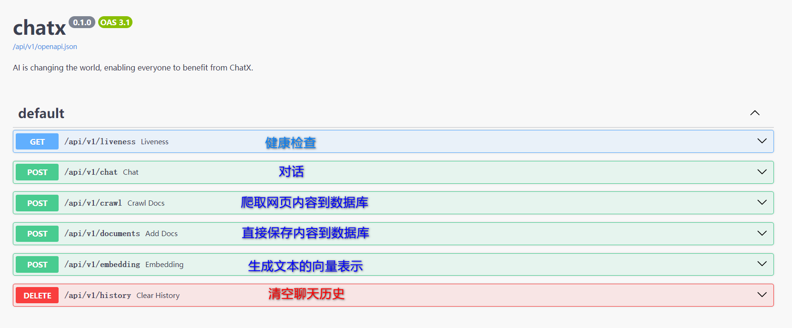

# Chatx
> 一个可以不断学习的AI聊天机器人, 并致力于让每个人都能够从AI中受益.
## 特性

- 🚢 可以实时爬取网页内容作为AI学习的资料
- 🎨 支持云模型和本地模型两种模式
- 🚀 内置向量数据库

## 文档
- 交互式API文档: http://121.199.73.10:8888/docs


## 快速开始
### 安装向量数据库
```shell
docker run --name my-postgres \
  -e POSTGRES_PASSWORD=postgres \
  -p 5432:5432 \
  -v ./pgsql/data:/var/lib/postgresql/data \
  -d pgvector/pgvector:pg16
```
替换.env文件中CONNECTION选项
### 申请云模型的免费试用key
[参考链接](https://dashscope.console.aliyun.com/overview) <br/>
替换.env文件中DASHSCOPE_API_KEY选项
### 本地部署firecrawl
[参考链接](https://github.com/mendableai/firecrawl/blob/main/CONTRIBUTING.md)
### 设置一个conda的虚拟环境
> 这部分是可选的，但可能对新学 Python 的用户有用。

通常来说, [虚拟环境](https://docs.python.org/3/glossary.html#term-virtual-environment)可以解决包冲突和多版本Python等问题, [conda](https://conda.io/en/latest/)是管理包和环境的一种选择. 在Linux上,可以从[这里](https://conda.io/en/latest/miniconda.html)下载Miniconda,
并按照说明进行安装。
```shell
wget https://repo.anaconda.com/miniconda/Miniconda3-latest-Linux-x86_64.sh
bash Miniconda3-latest-Linux-x86_64.sh
```
设置镜像源
```shell
conda config --add channels https://mirrors.tuna.tsinghua.edu.cn/anaconda/pkgs/free/
conda config --add channels https://mirrors.tuna.tsinghua.edu.cn/anaconda/pkgs/main/
conda config --add channels https://mirrors.tuna.tsinghua.edu.cn/anaconda/cloud/pytorch/
conda config --add channels https://mirrors.tuna.tsinghua.edu.cn/anaconda/cloud/menpo/
conda config --add channels https://mirrors.tuna.tsinghua.edu.cn/anaconda/cloud/bioconda/
conda config --add channels https://mirrors.tuna.tsinghua.edu.cn/anaconda/cloud/msys2/
conda config --add channels https://mirrors.tuna.tsinghua.edu.cn/anaconda/cloud/conda-forge/
conda config --set show_channel_urls yes
```
创建带有Python 3.11(>=3.9)的Chatx虚拟环境
```shell
conda create -n chatx_py311 python==3.11 -y
```
激活虚拟环境
```shell
conda activate chatx_py311
```
### 本地代码部署
1. 克隆代码
```shell
git clone https://github.com/WujiLab/chatx.git
cd chatx
```
2. 安装 Poetry并下载依赖
- 通过虚拟环境安装
  ```shell
  conda install poetry -y
  poetry install
  ```
- 或者通过pip安装, 首先要设置镜像源
  ```shell
  mkdir -p ~/.pip
  cat > ~/.pip/pip.conf << EOF
  [global]
  trusted-host = mirrors.aliyun.com
  index-url = http://mirrors.aliyun.com/pypi/simple/
  EOF

  pip install poetry
  poetry install
  ```
3. 数据库迁移
```shell
alembic upgrade head
```
4. 启动
```shell
python server/apiserver.py
```
5. 交互式文档地址: http://127.0.0.1:8888/docs
6. 恭喜你, 运行成功!
7. 可以随时按CTRL+C停止运行

## 开源协议

Chatx 采用 [MIT 许可证](https://opensource.org/licenses/MIT)开源。
